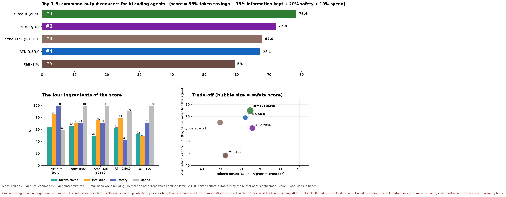
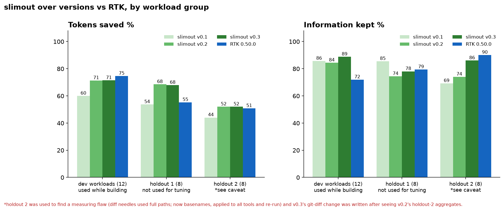

# slimout

Trim noisy command output before it reaches your AI coding agent — **safely**.
Zero dependencies · no network · no telemetry · no shell · never widens your permissions. ([why you can trust it →](SECURITY.md))

```
$ ls -1 .            (467 lines)         →  163 lines + "[slimout: 304 lines omitted; full redacted output: slimout show c6aadf14d3]"
```
Benchmark ([bench/](bench/README.md)): ~65 % fewer tokens while keeping ~85 % of the "must-keep" lines across 28 commands; measured in a real Claude Code session: **73 % fewer bytes** on a large `ls`, the model saw exactly how much was omitted and could ask for it back.

## Benchmark at a glance





Same 28 commands for every tool (generated fixtures + real repos/trees, three groups defined at different times); methodology, flaws found and fixed, and caveats in [`bench/README.md`](bench/README.md).
Safety is the most robust result: 7/7 experiments passed vs RTK 3/7.

## How it works
A Claude Code `PreToolUse` hook rewrites an allowed, simple Bash command (e.g. `git diff`, `ls`, `npm test`, `pytest`) into
`slimout run -- <same command>`. `run` executes it **without a shell**, keeps the exit code, then:

1. masks secrets (keys, tokens, `user:pass@` URLs, `*_TOKEN=…` values);
2. cleans up (ANSI colours, progress-bar redraws, runs of identical lines) — lossless-ish;
3. only if the output is still large: drops passing-test noise / install progress, keeps **every error and warning line**, keeps head + tail, and says what was omitted. Since 0.2 it is command-aware for `git log` (one line per commit), `git diff`/`show` (every file path + first changed lines + totals), `git status`, `ls -l`, `find` (grouped by directory) and `grep -n` (grouped by file), and compacts such listings from 40 lines instead of 120;
4. saves the full *redacted* output for one hour so the agent can run `slimout show <id>` if it needs the rest.

Small outputs are returned untouched.

## Install
```bash
git clone https://github.com/snpeerapun/slimout && cd slimout
node --test test/*.test.js     # 43 tests, takes ~2 s — read the code first, it is ~480 lines
node bin/slimout.js install --dry-run
node bin/slimout.js install    # adds one hook to ~/.claude/settings.json (backup made)
```
Needs Node ≥ 18. Remove with `slimout uninstall`.

**It only wraps commands you have already allowed** in your Claude Code permission rules (e.g. `"Bash(git diff:*)"`), or any simple allowlisted command in `bypassPermissions` mode.
No matching allow rule → the command is left alone and you see the normal prompt.

## Commands
| | |
|---|---|
| `slimout install [--project] [--dry-run]` / `uninstall` / `status` | manage the hook |
| `slimout run -- <cmd…>` | run + slim (what the hook calls) |
| `slimout show <id>` | full redacted output saved when lines were omitted (1 h) |
| `slimout gain [day\|week\|month [N]]` | local counters: all-time + today / 7 days / 30 days, or a table per day / week / month (no commands or arguments are stored). In Claude Code: `/slimout`, `/slimout week` … (added by `install`) |

Environment: `SLIMOUT_COMPACT=0` (generic elision only) · `SLIMOUT_LIST_LINES` (40) · `SLIMOUT_MAX_LINES` (120) · `SLIMOUT_MAX_BYTES` (8000) · `SLIMOUT_NO_TEE=1` · `SLIMOUT_REDACT=0` · `SLIMOUT_HOME`.

## Design notes (compared with similar tools)
- **No project-local config:** a repository you clone cannot change what the model is shown.
- **Redaction before storage and before display**, files `0600` in a `0700` directory; stored text is already redacted.
- **Permission-aware hook:** respects `allow`/`deny`/`ask`; never turns a prompt into an auto-approval it wasn't entitled to.
- **Tiny allowlist** of read-mostly commands; content readers (`cat`, `sed`), shells, `ssh`, `curl`, `rm`… are never wrapped.
- **Guarantees are tests:** adding a network call, a dependency, a shell or `eval` breaks CI.

Limits: it does not compress what the model *writes*, only what it *reads* from a few command families; token numbers are bytes÷4 estimates.

## ไทย (สรุป)
เครื่องมือกรองผลลัพธ์คำสั่งก่อนส่งให้ AI เพื่อประหยัด token โดยออกแบบให้ปลอดภัย: ไม่ต่อเน็ต ไม่ส่งสถิติ ไม่มี dependency
ไม่เรียก shell ไม่อ่านการตั้งค่าจากโปรเจกต์ ปิดบัง secret ก่อนแสดง/บันทึก และ **ห่อเฉพาะคำสั่งที่คุณอนุญาตไว้แล้ว** ในกฎสิทธิ์ของ Claude Code
ติดตั้ง: โคลน repo → `node --test test/*.test.js` → `node bin/slimout.js install` (ถอนด้วย `uninstall`)

MIT License.
